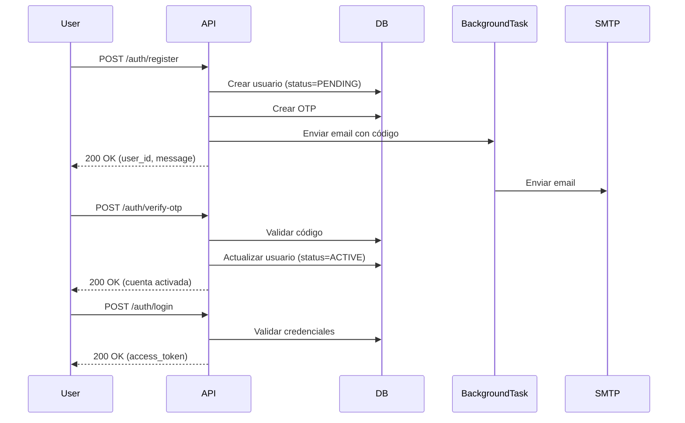

# 🏦 EcoFinanzas Backend - API de Análisis de Crédito

Backend refactorizado con arquitectura senior para análisis de créditos hipotecarios con IA.

## 🚀 Stack Tecnológico

- **Framework**: FastAPI 0.115.0
- **ORM**: SQLAlchemy 2.0.34
- **Database**: PostgreSQL 16+
- **Authentication**: JWT (python-jose)
- **Security**: bcrypt hashing
- **IA**: Gemini 1.5 Pro/Flash (pendiente integración)
- **Background Jobs**: APScheduler
- **PDF Processing**: PyPDF2

## 📋 Requisitos Previos

- Python 3.11+
- PostgreSQL 16+
- pip (gestor de paquetes)

## 🔧 Instalación

### 1. Clonar y navegar al directorio

```bash
cd backend/
```

### 2. Crear entorno virtual

```bash
python -m venv venv

# Windows
venv\Scripts\activate

# Linux/Mac
source venv/bin/activate
```

### 3. Instalar dependencias

```bash
pip install -r requirements.txt
```

### 4. Configurar variables de entorno

```bash
# Copiar el archivo de ejemplo
cp .env.example .env

# Editar .env con tus credenciales reales
notepad .env  # Windows
nano .env     # Linux/Mac
```

**Variables obligatorias:**
- `DATABASE_URL`: Conexión a PostgreSQL
- `SECRET_KEY`: Mínimo 32 caracteres aleatorios
- `SMTP_*`: Credenciales de email (Gmail App Password recomendado)

### 5. Inicializar base de datos

```bash
# Asegúrate que PostgreSQL esté corriendo
# Ejecutar desde la raíz del proyecto con Docker:
docker-compose up -d postgres

# O manualmente:
# createdb credit_analysis
# psql -d credit_analysis -f docker/postgres/init.sql
```

### 6. Ejecutar el servidor

```bash
uvicorn app.main:app --reload --host 0.0.0.0 --port 8000
```

La API estará disponible en: `http://localhost:8000`

## 📚 Documentación de la API

- **Swagger UI**: http://localhost:8000/docs
- **ReDoc**: http://localhost:8000/redoc

## 🔐 Endpoints Principales

### Auth
- `POST /api/v1/auth/register` - Registro de usuario
- `POST /api/v1/auth/verify-otp` - Verificar código OTP
- `POST /api/v1/auth/login` - Iniciar sesión

### Users (requiere autenticación)
- `GET /api/v1/users/me` - Ver perfil
- `PATCH /api/v1/users/me/password` - Cambiar contraseña

## 🏗️ Arquitectura

```
backend/
├── app/
│   ├── main.py                    # Punto de entrada, exception handlers
│   ├── api/
│   │   ├── deps.py               # Dependencias (auth, roles)
│   │   └── v1/
│   │       ├── router.py         # Router principal
│   │       ├── auth.py           # Endpoints de autenticación
│   │       └── users.py          # Endpoints de usuarios
│   ├── core/
│   │   ├── config.py             # Configuración (pydantic-settings)
│   │   ├── security.py           # JWT, hashing
│   │   ├── logging.py            # Logging centralizado
│   │   └── exceptions.py         # Exception handlers globales
│   ├── db/
│   │   ├── base.py               # Base declarativa SQLAlchemy
│   │   └── session.py            # Session factory
│   ├── models/                   # Modelos SQLAlchemy
│   │   ├── user.py               # Usuario
│   │   ├── otp.py                # Verificación OTP
│   │   ├── role.py               # Roles y permisos
│   │   ├── banco.py              # Bancos
│   │   ├── documento.py          # DocumentoS3 (metadata archivos)
│   │   ├── analisis.py           # AnalisisHipotecario
│   │   └── propuesta.py          # PropuestaAhorro
│   ├── repositories/             # Capa de acceso a datos
│   │   ├── users_repo.py
│   │   └── otp_repo.py
│   ├── schemas/                  # Pydantic schemas (DTOs)
│   │   ├── auth.py
│   │   └── user.py
│   └── services/                 # Lógica de negocio
│       ├── email_otp_service.py  # Envío de OTP por email
│       ├── pdf_service.py        # Procesamiento PDFs
│       ├── gemini_service.py     # Integración IA (esqueleto)
│       ├── calc_service.py       # Cálculos financieros
│       └── cleanup_service.py    # Limpieza usuarios PENDING
├── alembic/                      # Migraciones de DB
├── requirements.txt              # Dependencias Python
└── .env                          # Variables de entorno (no versionado)
```

## 🔒 Seguridad Implementada

### Autenticación
- ✅ JWT con expiración configurable
- ✅ HTTPBearer authentication
- ✅ Validación de estado ACTIVE del usuario
- ✅ Hashing de passwords con bcrypt

### Autorización
- ✅ Sistema RBAC (Role-Based Access Control)
- ✅ Decorador `require_role()` para protección granular
- ✅ Verificación de roles en cada request

### Integridad
- ✅ Constraints DB (unique email/identificación)
- ✅ Exception handlers para IntegrityError
- ✅ Rollback automático en transacciones fallidas
- ✅ SHA-256 checksum para archivos

### Resiliencia
- ✅ BackgroundTasks para operaciones I/O
- ✅ Cleanup automático de usuarios PENDING (10 min)
- ✅ Timeouts en conexiones SMTP
- ✅ Logging estructurado con niveles

## 📝 Flujo de Registro y Autenticación



## 🧪 Testing

### Validación Rápida
```bash
python validate_refactor.py
```

### Tests Unitarios (pendiente implementación)
```bash
pytest app/tests/
```

## 🐛 Troubleshooting

### Error: "Import PyPDF2 could not be resolved"
```bash
pip install PyPDF2==3.0.1
```

### Error: "6 validation errors for Settings"
- Falta el archivo `.env` o faltan variables requeridas
- Copia `.env.example` a `.env` y completa las variables

### Error SMTP: "Authentication failed"
- Para Gmail: Usa "App Password", no la contraseña normal
- Genera en: https://myaccount.google.com/apppasswords
- Habilita "Less secure app access" si usas otro proveedor

### Error: "Connection refused" (PostgreSQL)
```bash
# Verificar que PostgreSQL esté corriendo
docker-compose ps

# Iniciar PostgreSQL
docker-compose up -d postgres
```

## 📦 Dependencias Principales

```txt
fastapi==0.115.0          # Framework web
uvicorn[standard]         # ASGI server
SQLAlchemy==2.0.34        # ORM
psycopg2-binary           # Driver PostgreSQL
pydantic==2.9.2           # Validación datos
python-jose==3.3.0        # JWT
passlib[bcrypt]           # Hashing passwords
PyPDF2==3.0.1             # Procesamiento PDFs
apscheduler==3.10.4       # Background jobs
```

## 🚧 Pendientes de Implementación

- [ ] Integración Gemini API (extracción JSON de PDFs)
- [ ] Endpoints de análisis (upload, list, detail)
- [ ] Storage S3 o filesystem local
- [ ] Servicio de cálculos financieros completo
- [ ] Rate limiting con slowapi
- [ ] Tests unitarios e integración
- [ ] Matching de nombres con rapidfuzz

## 📄 Licencia

Propietario - EcoFinanzas © 2026

## 👥 Contacto

Para soporte técnico o consultas sobre el proyecto, contacta al equipo de desarrollo.
